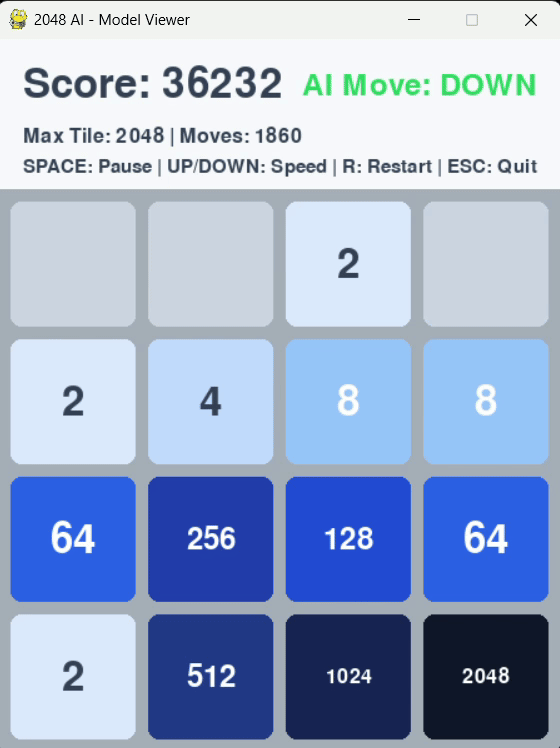

# AI Plays 2048 - Reinforcement Learning
AI learns to play the game 2048 through reinforcement learning, using N-tuple networks and temporal-difference learning.

## Table of Contents
- [Description](#description)

## Description
This project implements an AI agent that learns to play the game 2048 using N-tuple networks and temporal-difference learning, inspired by **published research**.
